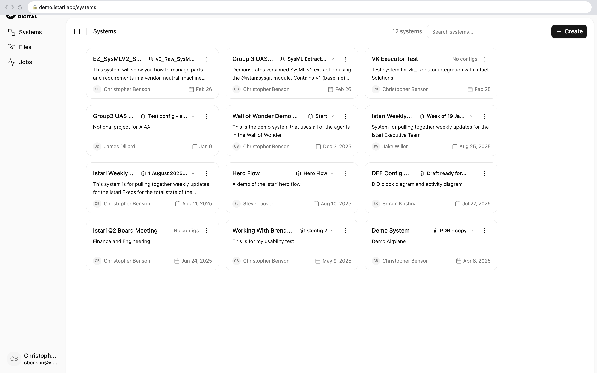
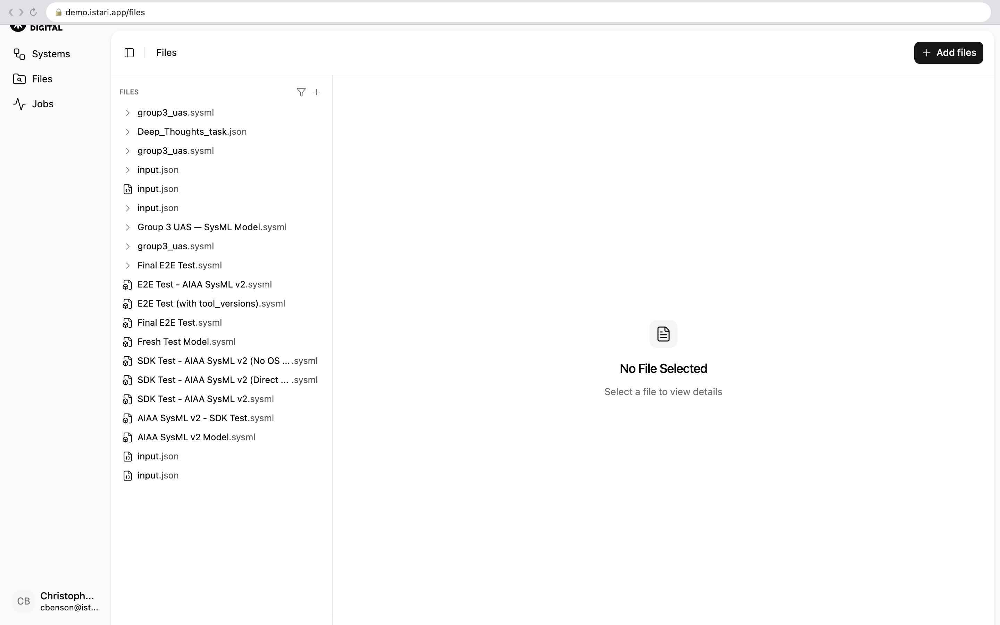
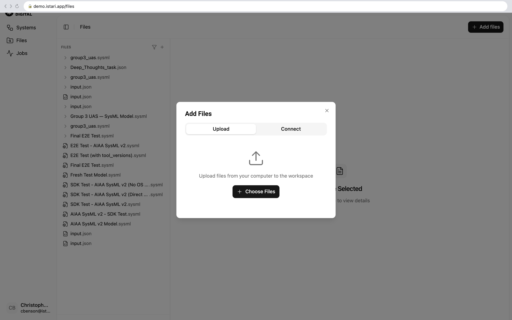
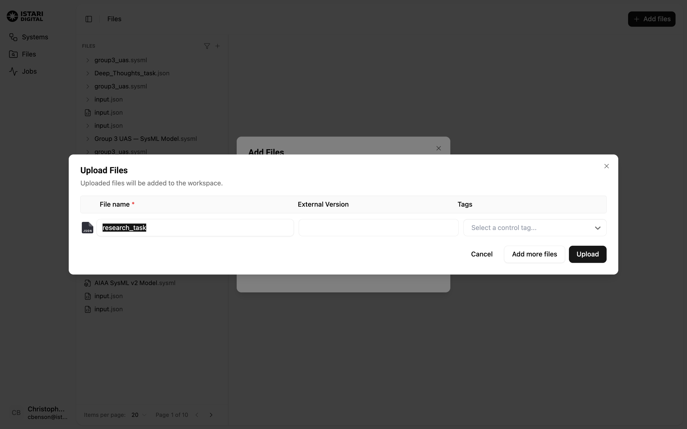

# Istari UI Walkthrough — Vibe Kanban Executor

This walkthrough shows how to create a task for the Vibe Kanban Executor module through the Istari UI. By the end, you'll have uploaded a task file, created a job, and seen the agent execute it.

> **Prerequisites:** An Istari account with the VK Executor module installed on your agent. See the main [README](../../README.md) for setup instructions.

---

## Step 1: Open the Istari Dashboard

Navigate to your Istari instance (e.g. `https://demo.istari.app`). The left sidebar has three main sections: **Systems**, **Files**, and **Jobs**.



---

## Step 2: Navigate to Files

Click **Files** in the left sidebar. This shows all uploaded files in your workspace — SysML models, JSON input files, and other artifacts. The **+ Add files** button in the top-right corner is how you upload new files.



---

## Step 3: Click "Add files"

Click the **+ Add files** button. A dialog appears with two tabs:

- **Upload** — Upload files from your computer
- **Connect** — Connect files from external sources

Click **+ Choose Files** to select your task JSON from your local machine.



---

## Step 4: Select Your Task File

Browse to your task JSON file and select it. The **Upload Files** dialog shows the file ready to upload. You can:

- Edit the **File name** (defaults to the filename without extension)
- Set an **External Version** (optional)
- Add **Tags** for organization

Here we're uploading `research_task.json` — a task that asks an AI agent to research CD/DC and explain how it relates to Istari.

Click **Upload** to upload the file to your workspace.



<details>
<summary>Example task file contents</summary>

```json
{
  "project_id": "cb527bb0-2050-4773-b09a-ebe16e692209",
  "task": "Go learn more about CD/DC at https://cdfam.com/cd-dc-26/ and explain how it relates to Istari",
  "agent": "claude-code",
  "repo_id": "965aedf6-56d8-4178-a816-02edbceb1292"
}
```

See [Task File Format](../../README.md#4-task-file-format) for all available fields.
</details>

---

## Step 5: Open the Uploaded File

After uploading, find your file in the Files list and click on it. The right panel shows file details including metadata, version history, and — most importantly — the **Create job** button.

> **Tip:** If you have many files, use the pagination at the bottom or the filter icon to narrow the list.

---

## Step 6: Create a Job

Click the **Create job** button on the file detail panel. A dialog appears asking you to select which function (tool) should process this file.

---

## Step 7: Select the VK Executor Function

In the **Create Job** dialog, click the function dropdown to see all available tools. Select **Vibe Kanban** (listed as `engineering_tools / @vibekanban:vk_executor`).

Then click **Execute Function** to submit the job. The Istari agent will claim the job and begin execution.

---

## Step 8: Monitor the Job

Navigate to **Jobs** in the left sidebar to see all jobs. The jobs list shows:

| Column | Description |
|--------|-------------|
| **Tool / Function** | The module that processed the job (e.g. `engineering_tools / @vibekanban:vk_executor`) |
| **Job ID** | Short unique identifier |
| **Started On** | Timestamp |
| **Status** | Current state: Pending, Running, Completed, or Failed |

You can see the VK Executor jobs completing successfully alongside other module jobs (like SysGit's `extract_sysmlv2`).


---

## What Happens Behind the Scenes

When the agent executes the VK Executor module, it:

1. **Reads** the uploaded task JSON file
2. **Connects** to the Vibe Kanban MCP server
3. **Creates an issue** in your VK project with the task description
4. **Starts an AI workspace session** linked to the issue (if `repo_id` is provided)
5. **Generates** an execution report (JSON + HTML) as job artifacts

```
┌─────────────┐      ┌──────────────┐      ┌──────────────┐      ┌──────────────┐
│  Istari UI  │─────▶│ Istari Agent │─────▶│ VK Executor  │─────▶│ Vibe Kanban  │
│ Upload task │      │ Claims job   │      │ entrypoint.py│      │  MCP Server  │
│ Create job  │      │ Runs module  │      │              │      │              │
└─────────────┘      └──────────────┘      └──────────────┘      └──────┬───────┘
                                                                        │
                                                                        ▼
                                                                ┌──────────────┐
                                                                │  Issue + AI  │
                                                                │  Workspace   │
                                                                │  Session     │
                                                                └──────────────┘
```

The AI agent (Claude Code, Codex, Gemini, etc.) then picks up the workspace and begins working on the task autonomously.

---

## Job Lifecycle

```
PENDING → CLAIMED → VALIDATING → RUNNING → UPLOADING → COMPLETED
                                    │
                                    ├── Creates VK issue
                                    └── Starts workspace session
```

| Status | What's happening |
|--------|-----------------|
| **Pending** | Job created, waiting for an agent to claim it |
| **Running** | Agent is executing the VK Executor module |
| **Completed** | Task file processed, issue created, workspace started |
| **Failed** | Something went wrong — check agent logs |

---

## Alternative: Create Jobs via SDK

You can also create jobs programmatically using the Istari Python SDK:

```python
from istari_digital_client.client import Client

c = Client()

# Upload the task file
model = c.add_model("research_task.json", description="CD/DC research task")

# Create a job — the model IS the input
job = c.add_job(model.id, "@vibekanban:vk_executor")

print(f"Job ID: {job.id}")
```

See the main [README](../../README.md#9-end-to-end-usage) for more details.

---

## Screenshots

These screenshots were captured automatically using a [Puppeteer script](../../scripts/walkthrough/capture.js) connected to a live Istari instance. To reproduce:

```bash
# 1. Launch Chrome with remote debugging
open -a "Google Chrome" --args --remote-debugging-port=9222

# 2. Log into your Istari instance in the browser

# 3. Run the capture script
cd scripts/walkthrough
npm install
node capture.js
```
